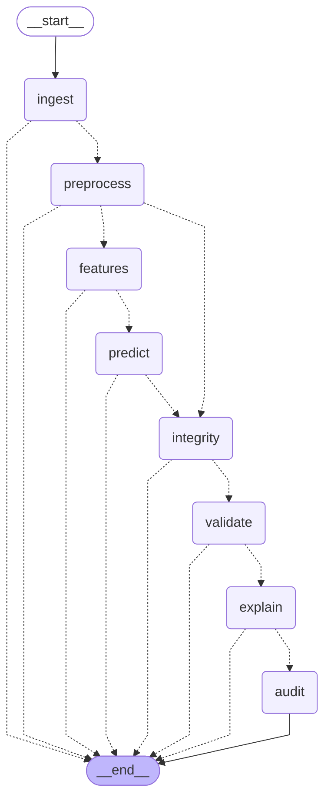

# Agent orchestration graph

```mermaid
---
config:
  flowchart:
    curve: linear
---
graph TD;
	__start__([<p>__start__</p>]):::first
	ingest(ingest)
	preprocess(preprocess)
	features(features)
	predict(predict)
	integrity(integrity)
	validate(validate)
	explain(explain)
	audit(audit)
	__end__([<p>__end__</p>]):::last
	__start__ --> ingest;
	explain -.-> __end__;
	explain -.-> audit;
	features -.-> __end__;
	features -.-> predict;
	ingest -.-> __end__;
	ingest -.-> preprocess;
	integrity -.-> __end__;
	integrity -.-> validate;
	predict -.-> __end__;
	predict -.-> integrity;
	preprocess -.-> __end__;
	preprocess -.-> features;
	preprocess -.-> integrity;
	validate -.-> __end__;
	validate -.-> explain;
	audit --> __end__;
	classDef default fill:#f2f0ff,line-height:1.2
	classDef first fill-opacity:0
	classDef last fill:#bfb6fc

```
